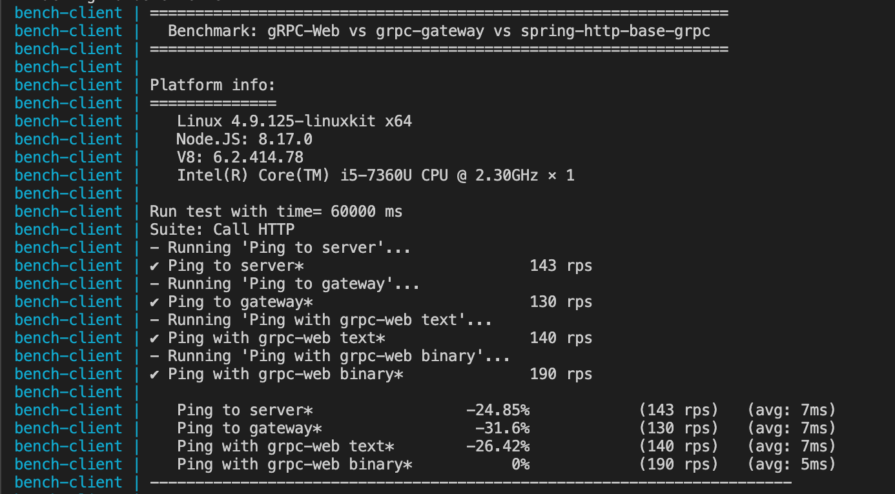

# Evaluating Performance of gRPC-Web vs grpc-gateway

This repository contains 2 equal APIs: using gRPC-Web with Envoy and using grpc-gateway. The goal is to run benchmarks for 2 approaches and compare them. APIs have 1 endpoint to ping. Benchmarks also include response parsing.

## Requirements

- Docker
- docker-compose

## Description

Using nodejs client and `benchmarkify` lib to benchmark.

Deployment model:

Flow definition:

- Direct request: call direct HTTP request to backend. Review spring-grpc-http to know more about this back. Result in this test will be seen like a baseline.
- Using grpc-gateway: call backend by using grpc-gateway.
- Using gRPC-Web: using gRPC-Web to call to backend. There are two options:
  - `mode=grpcwebtext`: Payload are base64-encoded.
  - `mode=grpcweb`: Payload are in the binary protobuf format.

## Run test

Steps:

  1. Start backend and gateways:
  
      ```sh
      docker-compose -f docker-compose-backend.yaml up
      ```
  1. Wait services is started successfully
  1. Configure test time by edit *BENCHMARK_TIME* in `docker-compose-client.yaml`.
  1. Start client
  
      ```sh
      docker-compose -f docker-compose-client.yaml up
      ```
  
## Results



As you see:
- Performance of gRPC-Web with text format and  direct calling HTTP is nearly equal.
- grpc-gateway is more slower
- gRPC-Web with binary format is the fastest.
